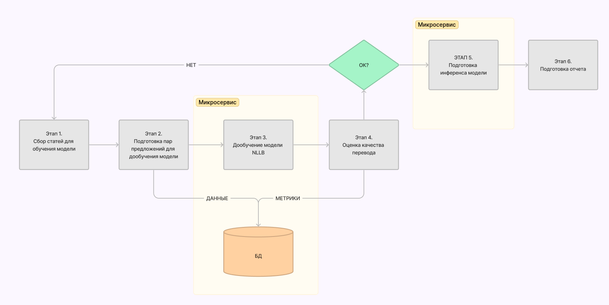

# ML System Design Doc - [RU]
# Дизайн ML системы - SciTranslate
## 1. Цели и предпосылки
### 1.1. Зачем идем в разработку продукта?
* Бизнес-цель: разработка продукта позволит Заказчику ускорить процесс перевода научных статей в издаваемых журналах  
* Текущий бизнес-процесс: переводчики используют полуавтоматизированную обработку текста с помощью самописных скриптов на Delphi и последующую редактуру "сырого" перевода. 
* Критерии успеха: уменьшение времени, затрачиваемого на редактуру перевода.
### 1.2. Бизнес-требования и ограничения
* Описание бизнес-процесса пилота. Пользователь сервиса загружает текстовый файл на русском языке и скачивает файл с переводом на английский. 
*  Временных ограничений на разработку нет
### 1.3. Что не входит в скоуп итерации:
* Возможность загрузки pdf-файлов
## 2. Методология 
### 2.1. Постановка задачи
Что делаем с технической точки зрения: система по машинному переводу
### 2.2. Блок-схема решения 

### 2.3. Этапы решения задачи
## 4. Внедрение

