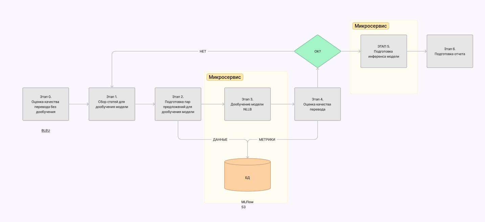

# ML System Design Doc - [RU]
# Дизайн ML системы - SciTranslate
## 1. Цели и предпосылки
### 1.1. Зачем идем в разработку продукта?
* Бизнес-цель: внедрить современные нейросетевые модели в процесс перевода научных статей в англоязычных версиях журналов Кристаллография и Оптика и Спектроскопия, издаваемых Российской Академией Наук.   
* Использование ML позволит уменьшить время, затрачиваемое на перевод статей. Сейчас переводчики используют полуавтоматизированную обработку текста с помощью самописных скриптов на Delphi. Текст после такой обработки требует значительного преобразования. 
* Критерий успеха итерации: уменьшение времени, затрачиваемого на перевод.
### 1.2. Бизнес-требования и ограничения
* Бизнес-требования: продукт должен обеспечивать перевод в направлении рус --> англ и терминологическую точность в доменных областях Кристаллография, Оптика и Спектроскопия. Продукт должен содержать пользовательский интерфейс, с помощью которого переводчик сможет загрузить текстовый файл на русском языке и скачать текстовый файл с переводом. Сервис должен обеспечивать перевод объемных обзорных статей, размером до 100_000 знаков. Требования к быстродействию системы не предъявляются. Требования к сохранению форматирования текста не предъявляются. 
* Бизнес-ограничения: Временные ограничения на разработку продукта - до 12.12.2023     
* Критерий успеха пилота: увеличение производительности труда переводчика, которую можно количественно оценить как уменьшение времени, затрачиваемого на перевод 1 статьи.
* Возможные пути развития проекта, не входящие в скоуп итерации:
  - добавление новых направлений перевода
  - добавление новых доменных областей перевода
  - добавление в интерфейс окна для перевода текста произвольной длины без загрузки файлов
  - обработка файлов в pdf формате
  - разработка автоматических систем по сбору обучающих данных. (1) веб-парсинг литературных источников из соответствующих областей знаний и (2) система экспертной разметки перевода, где эксперт может отдельно оценивать перевод каждого предложения и выбирать лучший из нескольких вариантов перевода одного предложения.

## 2. Методология 
### 2.1. Постановка задачи
Что делаем с технической точки зрения: система по машинному переводу
### 2.2. Блок-схема решения 
- MVP - сервис с опенсорсным API (например, DeepL) 

    Блок-схема:  TODO
- Бейзлайн -  дообученная модель NLLB

    Блок-схема: 

### 2.3. Этапы решения задачи
TODO: заполняется отдельно для бейзлайна, отдельно для mvp

